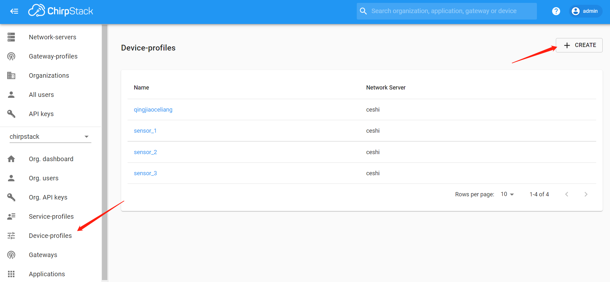
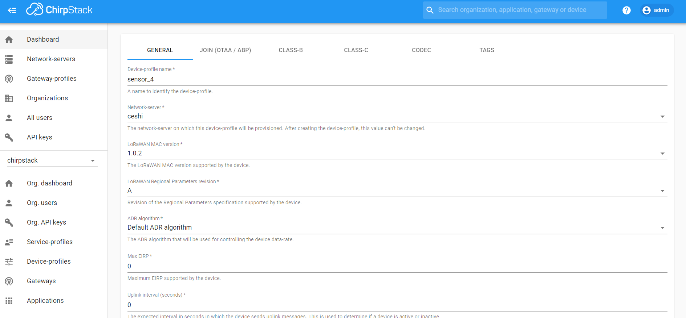
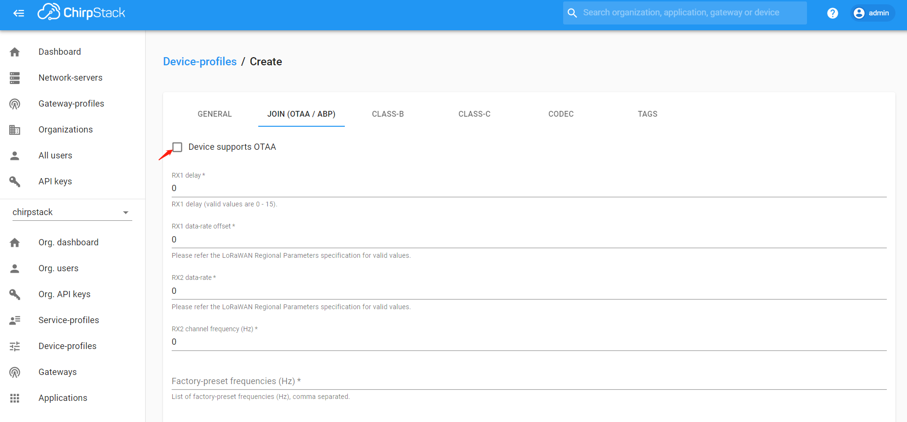
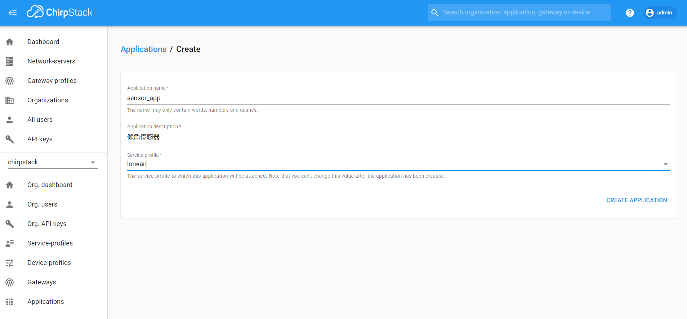
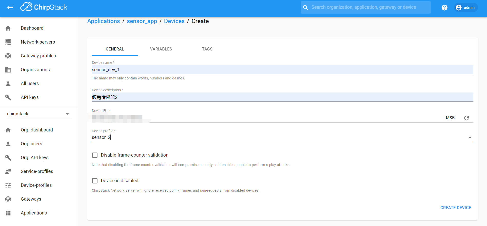
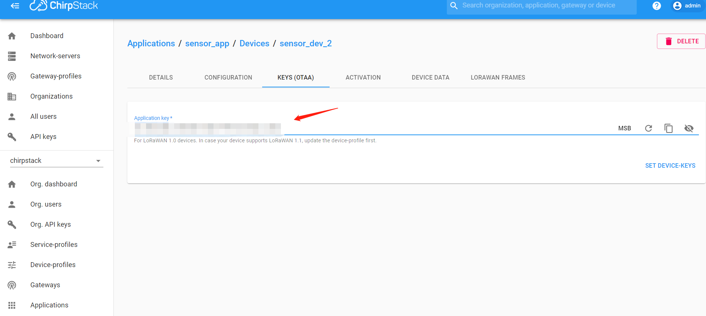
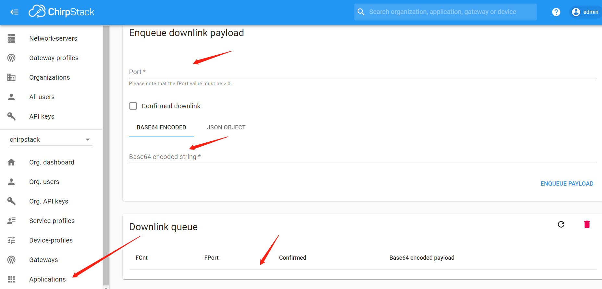

# 物联网lowanwan协议倾角传感器
## chirpStack添加倾角传感器步骤
* 创建DEV_Profiles


* 倾角传感器默认OTAA入网

* 创建APP应用

* 创建APP应用下的传感器

* 添加OTAA值

## 接受上行数据
* 通过chirpStack获取数据
* 通过订阅MQTT主题方式过去数据
## 发送下行数据传感器信息
* 通过chirpStack的Downlink queue下发数据

* 通过调用chirpStack API发送下行数据
代码文件```send_change_data.py```

